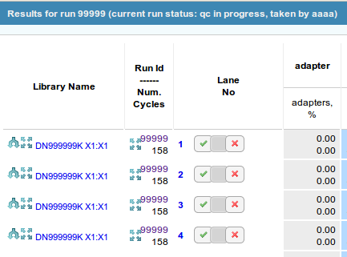
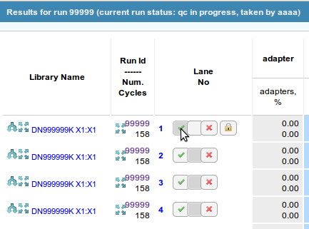

User's Manual for NPG SeqQC v58.1+
==================================

.. contents:: Table of Contents

Manual QC
---------

Changes to Manual QC 
~~~~~~~~~~~~~~~~~~~~

This version includes changes which are expected to improve usability of the 
application. It allows to capture intention of the outcome of QC. We hope this 
will prevent mistakes while checking the lanes and allow for a review before 
committing to a final outcome. We also hope it will facilitate training by
allowing new users to move between preliminary outcomes before making a final
decision.

Preliminary outcomes
++++++++++++++++++++

The current software version allows for lane outcomes to be marked as 
preliminary. Preliminary outcomes do not directly affect the status of a run. 
They can only be modified by the same user which took the run for manual QC but
are visible to other users of the application.

Preliminary outcomes are saved between browser sessions. So logging out or 
closing the browser window will not delete the preliminary outcomes. Once a 
lane has been marked with a preliminary outcome, it will remain with that 
outcome until the user changes to a different preliminary outcome or saves 
the preliminary outcome as final. 

Final outcomes
++++++++++++++

Final outcomes represent the final QC decision for a lane. Once a preliminary 
outcome is saved as final, it is considered as ready to be reported. Currently
there are is no way to modify a final outcome using this web application.
Once all lanes in a specific run have a final outcome, the run will move 
automatically to the next status (archival pending).

New layout of QC controls
+++++++++++++++++++++++++

After taking a run for manual QC, the SeqQC application will initially present
three buttons per lane to the user. The individual buttons represent preliminary
outcomes (*pass*/*undecided*/*fail*). By default all lanes with start as 
*undecided*.

  
  New layout of the manual QC controls with three buttons per lane.

A fourth button will be available whenever a preliminary *pass*/*fail* is 
selected. This button allows for the current *pass*/*fail* to be saved as
final.

  
  New layout of the manual QC controls with a fourth button to allow to save as
  final.

New manual QC flow
~~~~~~~~~~~~~~~~~~

Initially all lanes start as *undecided* QC. With the new flow, the user can 
switch indefinitely between preliminary outcomes.

  
