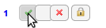
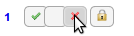
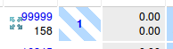
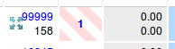
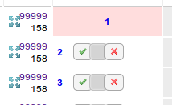
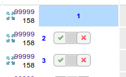
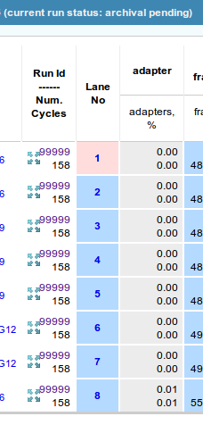

User's Manual for NPG SeqQC v58.1+
==================================

:Authors:

  Jaime Tovar

:Version: 2015.05.26

.. contents:: Table of Contents

Manual QC
---------

Changes to Manual QC 
~~~~~~~~~~~~~~~~~~~~

This version includes changes which are expected to improve usability of the 
application. It allows to capture intention of the outcome of QC. We hope this 
will prevent mistakes while checking the lanes and allow for a review before 
committing to a final outcome. We also hope it will facilitate training by
allowing new users to move between preliminary outcomes before making a final
decision.

Preliminary outcomes
++++++++++++++++++++

The current software version allows for lane outcomes to be marked as 
preliminary. Preliminary outcomes do not directly affect the status of a run. 
They can only be modified by the same user which took the run for manual QC but
are visible to other users of the application.

Preliminary outcomes are saved between browser sessions. So logging out or 
closing the browser window will not delete the preliminary outcomes. Once a 
lane has been marked with a preliminary outcome, it will remain with that 
outcome until the user changes to a different preliminary outcome or saves 
the preliminary outcome as final. 

Final outcomes
++++++++++++++

Final outcomes represent the final QC decision for a lane. Once a preliminary 
outcome is saved as final, it is considered as ready to be reported. Currently
there are is no way to modify a final outcome using this web application.
Once all lanes in a specific run have a final outcome, the run will move 
automatically to the next status (*archival pending*).

New layout of QC controls
+++++++++++++++++++++++++

After taking a run for manual QC, the SeqQC application will initially present
three buttons per lane to the user. The individual buttons represent preliminary
outcomes (*pass*/*undecided*/*fail*). By default all lanes with start as 
*undecided*.

.. figure:: images/01_s.png
  :height: 700px
  :alt: New layout with three buttons
  :align: center
  
  New layout of the manual QC controls with three buttons per lane

A fourth button will be available whenever a preliminary *pass*/*fail* is 
selected. This button allows for the current *pass*/*fail* to be saved as
final.

.. figure:: images/03_s.png
  :height: 700px
  :alt: Fourth (save) button
  :align: center
  
  New layout of the manual QC controls with a fourth button to allow to save as
  final

New manual QC flow
~~~~~~~~~~~~~~~~~~

Initially all lanes start as *undecided* QC. With the new flow, the user 
working on the QC can switch indefinitely between preliminary outcomes 
or go back to *undecided*.

  Undecided

  Preliminary pass

  Preliminary fail
  
Other users of the application will not be able to see the widgets for QC, but 
will be able to see preliminary decisions marked as stripped colours.

  Preliminary pass as seen by other users

  Preliminary fail as seen by other users

A preliminary decision (in this case a *fail*) can be saved as final by 
clicking on the **lock** icon located to the right of the preliminary 
selector. This icon is only available when a lane is marked with a 
preliminary *pass* or *fail*. Once a preliminary outcome has been saved
as final, it can not be changed back using this application.

 .. figure:: images/07_final_window.png
  :height: 300px
  :alt: Saving a preliminary fail as final
  :align: center

  Saving a preliminary fail as final

After the QC outcome is saved as final, the widgets for QC will not be available
and the background of the cell will change to solid red to show the final
decision.

  Background colour showing a final fail

Alternatively if a lane is marked as a preliminary pass and then saved as final 
the background of the cell will change to solid blue.

  Background colour showing a final pass
  
Once all the lanes in a run have final outcomes, the run will be moved to the
next status (*archival pending*). All users of the application will still be
able to see the final decisions marked with red or blue backgrounds for each 
lane.

  Run after changing status to archival pending. All lanes have a final outcome
  and the final outcome is visible to all users.
